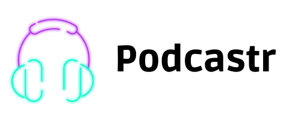

# NLW 5 - Trilha React e Next.js

> Projeto feito na [Next Level Week](nextlevelweek.com) 5 da [Rocketseat](https://www.rocketseat.com.br). O projeto consiste em uma página para reprodução de um podcast chamado Podcastr.

### Ajustes e melhorias

O projeto ainda está em desenvolvimento e, após a finalização do projeto no curso, as seguintes alterações são planejadas:

- [x] Inserção de ícones nos botões
- [ ] Responsividade
- [ ] Tema escuro
- [ ] Estudar a possibilidade de PWA (Progressive Web App)
- [ ] Estudar a possibilidade de usar o framework [Electron](https://www.electronjs.org) para uma versão desktop

## 💻 Características do projeto

### Tecnologias utilizadas
* [TypeScript](https://www.typescriptlang.org)
* [React](https://pt-br.reactjs.org)
* [Next.js](https://nextjs.org)
* [Vercel](https://vercel.com) para hospedagem do front-end
* [json-server](https://github.com/typicode/json-server) para a simulação de um back-end
* [Heroku](https://www.heroku.com) para a hospedagem do back-end
* [Sass](https://sass-lang.com)
* [Axios](https://axios-http.com/docs/intro)
* etc.

### Obsercações
* Este software foi desenvolvido no [Visual Studio Code](https://code.visualstudio.com) utilizando o Windows 10 como SO
* Para executar o sistema e comandos no Yarn, foi utilizado o [Windows Subsystem for Linux](https://docs.microsoft.com/pt-br/windows/wsl/install)

## 🔥 Preview

